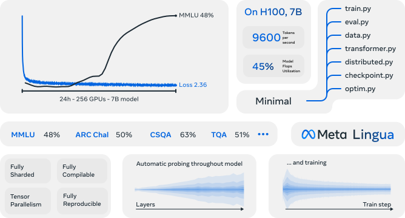

<div align="center">

```
                          ❦  ·  ❦  ·  ❦
```

# &mdash; LT2 &mdash;
### *Linear-Time Looped Transformers*

*A modest treatise upon a family of* **looped Transformers** *with*
**subquadratic token mixers** — *linear, sparse, and hybrid attention,*
*compass'd within a single architecture.*

```
                          ❦  ·  ❦  ·  ❦
```

<p align="center">
 
</p>

</div>

> Official codebase accompanying the paper **"LT2: Linear-Time Looped Transformers."**
> Built upon the [Meta Lingua](https://github.com/facebookresearch/lingua) pre-training framework.

<div align="center">

```
═══════════════════════════════════════════════════════════════
```

</div>

## I. &nbsp; Of the Architecture

LT2 supplanteth the multi-head attention sub-layer of a standard Looped Transformer with a
**subquadratic token mixer**, so that each shared block becometh

$$F_\ell(h) \;=\; h' + \mathrm{FFN}_\ell(h'), \qquad h' \;=\; h + \mathrm{Mixer}_\ell(h)$$

wherein `Mixer` may be any linear-attention, sparse-attention, or hybrid primitive. Looping
reuseth the same parameters `T` times in succession, so that a block of `n_layers` attaineth
an effective depth of `n_layers × T`.

- &nbsp;**LT2-linear** &mdash; DPLR linear-attention mixers (GDN, KDA, Mamba2, HGRN2, DeltaNet, RetNet). Loop iterations turn rank-1 state updates into rank-`T` updates.
- &nbsp;**LT2-sparse** &mdash; sliding-window, NSA, or DSA attention. A per-loop window of size `w` becometh an effective receptive field of `T·w`.
- &nbsp;**LT2-hybrid (Full+GDN)** &mdash; interleaveth a small fraction of full attention with GDN; surpasseth the standard looped transformer at ~2.7× decode speedup, establishing a new Pareto frontier.

The reader is referr'd to the paper for the full theoretical analysis and experimental results.

<div align="center">

```
═══════════════════════════════════════════════════════════════
```

</div>

## II. &nbsp; Of the Repository

```
LT2/
 ├─ lingua/             ── Core training library (forked from Meta Lingua)
 │   ├─ transformer.py     · Reference Transformer block
 │   ├─ data.py            · Pre-training dataloader
 │   ├─ distributed.py     · FSDP / TP / compile wrappers
 │   ├─ checkpoint.py      · Distributed checkpointing
 │   ├─ optim.py           · Optimizer + LR scheduler
 │   └─ stool.py           · SLURM launcher
 ├─ apps/LT2/           ── LT2 application code
 │   ├─ transformer.py     · LT2 model (linear / sparse / hybrid mixers)
 │   ├─ train.py           · Training entry point
 │   ├─ eval.py            · LM-Evaluation-Harness wrapper
 │   ├─ generate.py        · Inference / generation
 │   ├─ benchmark_prefill.py
 │   ├─ configs/
 │   │   ├─ 600M/          · 0.6B-parameter pre-training recipes
 │   │   └─ 1B/            · 1.3B-parameter pre-training recipes
 │   ├─ kernel/            · Custom Triton / CUDA kernels
 │   ├─ scripts/           · Helper scripts
 │   └─ slurm/             · Example SLURM job files
 ├─ setup/              ── Environment + data preparation
 ├─ tokenizer/          ── Tokenizer files (downloaded)
 └─ requirements.txt
```

<div align="center">

```
═══════════════════════════════════════════════════════════════
```

</div>

## III. &nbsp; Of the Quick Start

The following commands launch a SLURM job that createth a Conda environment for the codebase.
Environment creation taketh around five minutes (excluding downloads).

```bash
git clone <THIS_REPO_URL>
cd LT2

bash setup/create_env.sh
# or, if you have access to a SLURM cluster
sbatch setup/create_env.sh
```

Once that is done, activate the environment:

```bash
conda activate lingua_<date>
```

Use the provided script to download and prepare data from HuggingFace
(`fineweb_edu`, `fineweb_edu_10bt`, or `dclm_baseline_1.0`). The command below downloadeth
`fineweb_edu` and prepareth it for training in `./data`, specifying the memory `terashuf`
(the shuffling tool) is allowed to use. By default `nchunks=32`; if you train on fewer than
32 GPUs, set `nchunks` to 1 or to the number of GPUs you have
([details](https://github.com/facebookresearch/lingua/issues/55#issuecomment-2483643076)).

```bash
python setup/download_prepare_hf_data.py fineweb_edu <MEMORY> \
    --data_dir ./data --seed 42 --nchunks <NCHUNKS>
```

Download the tokenizer (Llama 3):

```bash
python setup/download_tokenizer.py llama3 <SAVE_PATH> --api_key <HUGGINGFACE_TOKEN>
```

Now launch a quick debug job to verify the setup. *The provided configurations are
templates &mdash; edit `dump_dir`, `data.root_dir`, `data.tokenizer.path`, etc., for your environment.*

```bash
# stool = SLURM tool
python -m lingua.stool script=apps.LT2.train \
    config=apps/LT2/configs/600M/debug.yaml \
    nodes=1 partition=<partition>

# Or launch locally with torchrun
torchrun --nproc-per-node 8 -m apps.LT2.train \
    config=apps/LT2/configs/600M/debug.yaml

# Or on a single GPU
python -m apps.LT2.train config=apps/LT2/configs/600M/debug.yaml
```

If a `stool` job crasheth, it may be relaunched directly:

```bash
sbatch path/to/dump_dir/submit.slurm
```

<div align="center">

```
═══════════════════════════════════════════════════════════════
```

</div>

## IV. &nbsp; Of the LT2 Configuration

### &nbsp;&nbsp;&nbsp;&nbsp;§ Model Fields

The LT2 model is configured through the `model:` section of the YAML config. Key fields:

| Field | Description |
|---|---|
| `n_layers` | Number of *physical* (parameter-sharing) layers in the looped block. |
| `loop_count` | Number of loop iterations `T`. Effective depth is `n_layers × loop_count`. |
| `mixer` | Token-mixer family: `full`, `window`, `gdn`, `kda`, `mamba2`, `hgrn2`, `deltanet`, `retnet`, `nsa`, `dsa`. |
| `attention_pattern` | Depth-level hybrid layout (e.g. `"4:1"` for 4 mixer + 1 full attention). |
| `attn_impl` | `"fmha"`, `"flex_attention"`, or `"sdpa"`. Sliding-window requireth `fmha` or `flex_attention`. |
| `default_sliding_window` | Window size for sparse / sliding-window mixers. |
| `use_residual` | Learned zero-init per-iteration residual gate across loop iterations. |
| `gated_attn` | SDPA output gate that suppresseth the attention-sink sawtooth (§ 3.4 of the paper). |

Example fragment:

```yaml
model:
  dim: 2048
  n_layers: 20
  loop_count: 4              # T = 4, effective depth = 80
  mixer: "gdn"
  attention_pattern: "4:1"   # 4 GDN layers : 1 full-attention layer
  attn_impl: "fmha"
  default_sliding_window: 2048
  use_residual: true
  gated_attn: true
```

### &nbsp;&nbsp;&nbsp;&nbsp;§ Recipes Included

`apps/LT2/configs/` providest reference pre-training recipes for the experiments in the paper:

<div align="center">

| Scale | Config | Description |
|:---:|---|---|
| 0.6B | `600M/debug.yaml` | Fast smoke test (single GPU). |
| 0.6B | `600M/looped_pure_full_600M.yaml` | Looped Transformer baseline (full attention). |
| 0.6B | `600M/looped_pure_{gdn,kda,mamba2,deltanet,retnet,hgrn2}_600M.yaml` | LT2-linear single-mixer ablations. |
| 0.6B | `600M/looped_pure_{window,nsa,dsa}_600M.yaml` | LT2-sparse single-mixer ablations. |
| 0.6B | `600M/looped_hybrid_gdn_4to1_600M.yaml` | **LT2-hybrid (Full+GDN)**, 4:1 depth interleave. |
| 0.6B | `600M/looped_hybrid_bookend_600M.yaml` | LT2-hybrid (Full+GDN), bookend pattern. |
| 0.6B | `600M/looped_hybrid_128_256_512_full_600M.yaml` | Loop-level hybrid (fine &rarr; coarse). |
| 1.3B | `1B/looped_pure_{full,gdn,kda,...}_1B.yaml` | 1.3B single-mixer recipes. |
| 1.3B | `1B/looped_hybrid_gdn_4to1_1B.yaml` | **LT2-hybrid (Full+GDN)** at 1.3B &mdash; flagship recipe. |

</div>

All recipes train on **FineWeb-Edu** at sequence length 4096 for ~100B tokens (255k steps),
using `T = 4` loops by default.

### &nbsp;&nbsp;&nbsp;&nbsp;§ Training

```bash
# Single-node debug
torchrun --nproc-per-node 8 -m apps.LT2.train \
    config=apps/LT2/configs/600M/debug.yaml

# Multi-node via stool
python -m lingua.stool script=apps.LT2.train \
    config=apps/LT2/configs/1B/looped_hybrid_gdn_4to1_1B.yaml \
    nodes=8 partition=<your_partition>

# Override fields on the command line
torchrun --nproc-per-node 8 -m apps.LT2.train \
    config=apps/LT2/configs/600M/looped_hybrid_gdn_4to1_600M.yaml \
    model.loop_count=4 \
    model.attention_pattern="4:1" \
    model.default_sliding_window=2048
```

### &nbsp;&nbsp;&nbsp;&nbsp;§ Generation & Evaluation

```bash
# Free-form generation from a checkpoint
python -m apps.LT2.generate ckpt=/path/to/checkpoint \
    max_gen_len=256 temperature=0.7

# Zero-shot evaluation on LM-Evaluation-Harness suites
torchrun --nproc-per-node 8 -m apps.LT2.eval \
    config=apps/LT2/configs/600M/eval.yaml \
    ckpt_dir=/path/to/checkpoint
```

### &nbsp;&nbsp;&nbsp;&nbsp;§ Long-Context Efficiency Benchmark

`benchmark_prefill.py` measureth prefill / decode throughput across sequence lengths:

```bash
python -m apps.LT2.benchmark_prefill \
    --config apps/LT2/configs/1B/looped_hybrid_gdn_4to1_1B.yaml \
    --seq-len 8192
```

A reference SLURM array script is provided in `apps/LT2/slurm/benchmark_prefill_array.slurm`.

<div align="center">

```
═══════════════════════════════════════════════════════════════
```

</div>

## V. &nbsp; Of the Configuration System

All scripts use [OmegaConf](https://omegaconf.readthedocs.io/) and accept dot-list overrides:

```bash
python -m apps.LT2.train config=apps/LT2/configs/600M/debug.yaml \
    model.dim=1024 \
    optim.lr=2e-4 \
    name=my_run
```

Resolution order: *dataclass defaults &rarr; values from `config=...` YAML &rarr; command-line overrides.*

A typical `TrainArgs` YAML:

```yaml
dump_dir: /path/to/dumpdir
name: "lt2_hybrid_gdn_4to1_1B"
steps: 255000
seed: 777

optim:
  lr: 3e-4
  warmup: 5000
  lr_min_ratio: 1e-6
  clip: 1.0

distributed:
  fsdp_type: full_shard
  compile: true

model:
  dim: 2048
  n_layers: 20
  loop_count: 4
  mixer: "gdn"
  attention_pattern: "4:1"

data:
  root_dir: ./data/fineweb_edu
  batch_size: 4
  seq_len: 4096
  tokenizer:
    name: tiktoken
    path: ./tokenizer/original/tokenizer.model
```

<div align="center">

```
═══════════════════════════════════════════════════════════════
```

</div>

## VI. &nbsp; Of the Dump Directory

```
example_dump_dir/
 ├─ checkpoints/
 │   └─ 0000007000/        · DCP-format checkpoint + train state
 ├─ code/                  · Snapshot of code at launch time
 ├─ logs/                  · Per-GPU stdout/stderr
 ├─ profiling/             · Memory + CPU/CUDA traces
 ├─ base_config.yaml
 ├─ metrics.jsonl
 └─ submit.slurm
```

Checkpoints are stored in `.distcp` format and may be converted to standard PyTorch checkpoints
via `torch.distributed.checkpoint.format_utils.dcp_to_torch_save`.

<div align="center">

```
═══════════════════════════════════════════════════════════════
```

</div>

## VII. &nbsp; Of the Citation

Should this codebase prove of service in your own labours, kindly cite the LT2 paper:

```bibtex
@misc{lt2_2026,
  title  = {LT2: Linear-Time Looped Transformers},
  author = {Anonymous},
  year   = {2026}
}
```

This work standeth upon the shoulders of Meta Lingua:

```bibtex
@misc{meta_lingua,
  author = {Videau, Mathurin and Idrissi, Badr Youbi and Haziza, Daniel and
            Wehrstedt, Luca and Copet, Jade and Teytaud, Olivier and
            Lopez-Paz, David},
  title  = {{Meta Lingua}: A minimal {PyTorch LLM} training library},
  url    = {https://github.com/facebookresearch/lingua},
  year   = {2024}
}
```

<div align="center">

```
                          ❦  ·  ❦  ·  ❦
```

*&mdash; Finis &mdash;*

</div>
